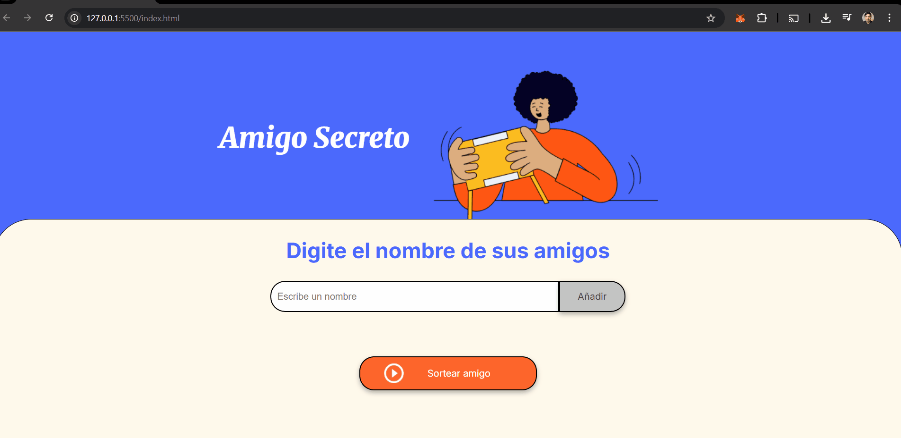

# 🎉 Sorteo de Amigo Secreto

Pequeña aplicación en JavaScript para agregar amigos a una lista y sortear uno al azar.  
Ideal para rifas, amigo invisible o cualquier dinámica divertida. 😄

## 🚀 Características
- Agregar amigos a una lista dinámica.
- Sorteo aleatorio de un amigo.
- Confirmación para reiniciar el juego.
- Reinicio limpio de la lista y resultados.

## 📸 Vista previa
  

## 🛠️ Tecnologías utilizadas
- HTML5
- CSS3
- JavaScript (DOM manipulation)

## 📂 Estructura básica
📁 sorteo-amigos

 ├── assets

 ├── app.js
 
 ├── index.html
 
 ├── style.css
 
 └── README.md

## 💻 Uso
1. Escribe el nombre de un amigo en el campo de texto.
2. Haz clic en "Añadir".
3. Cuando quieras sortear, presiona "Sortear amigo".
4. Confirma si quieres reiniciar el juego.

## 👨‍💻 Autor
Martin Federico Moran

📧 martinfmoran81@gmail.com

🌐 https://github.com/MartinMoran
